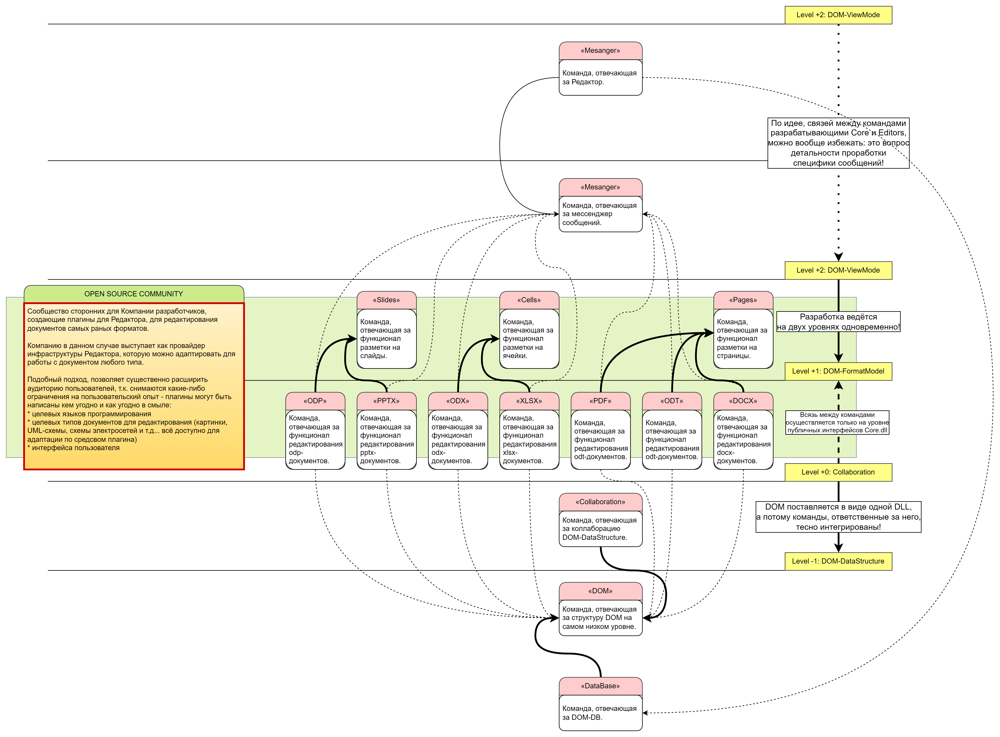

# «5-Level Core Model» описание через структуру команд Компании
**Визуализация структуры Системы, относительно её влияния на организацию структуры R&D департамента.**

## Основная цель анхитектуры Системы для R&D
**Введение нового продукта/решения - есть лишь вопрос горизонтального масштабирования = вопрос добавления новой независимой команды разработчиков уровней +1+2**

### Ключевые нюансы:
- Команды уровня -1 +0 никак не зависят от команд вышележащих уровней.
- Команда ответственная за «Messanger» ничего не знает о специфики приложений разных уровней Системы, коммуникацию между которыми обеспечивает.
- Команды уровня +1 +2 являются независимыми от выше/ниже лежащих уровней в том смысле, что не несут никакой ответственности за корректность их работы:
    - от уровней +0 -1, данные команды получают только Core.dll , предоставляющую интерфейсы основных классов: DOM  и DomDB 
    - - от уровня +3, данные команды получают только спецификацию на составление сообщений, посылаемых в Messanger 
- Вся Система совокупно может рассматриваться как инфраструктура, наполнение которой специфическим функционалом открыто для сторонних разработчиков и не ограничено языковыми средствами.