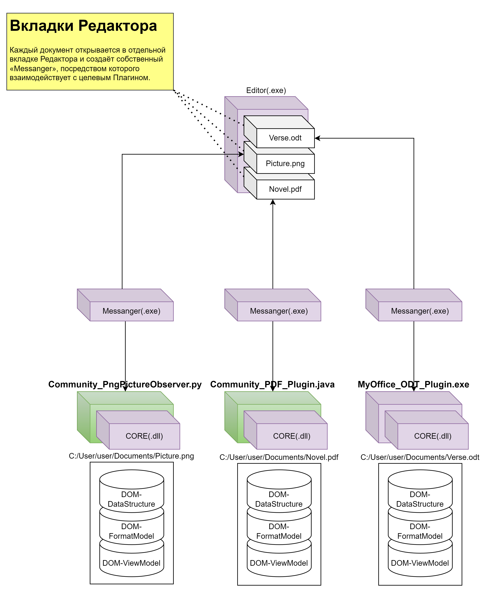

# «5-Level Core Model» описание через артефакты (работа над множеством документов)
**Визуализация структуры Системы на уровне её артефактов на различных уровнях и процессах ОС, сорганизованных между собой согласно модели совокупного взаимодействия, ради решения главной задачи - редактирования электронного документа.**

В качестве упрощения, пусть будет введено 2 предположения:
- Целевая ОС - это Windows-10
- Система настроена для работы со множеством документом:
    - C:/User/user/Documents/Verse.odt, через C++-плагин, созданный Компанией, «MyOffice_ODT_Pluging.exe»
    - C:/User/user/Documents/Novel.pdf, через Java-плагин, созданный свободным комьюнити, «Community_PDF_Plugin.js»
    - C:/User/user/Documents/Picture.png, через Python-плагин, созданный свободным комьюнити, «Community_PngPictureObserver.py»

## Важные моменты
1. Редактор, как часть Системы, изначально не предназначен для редактирования какого-либо конкретного типа документов, но является платформой, гибко адаптируемой для работы с документом любого типа.
2. Каждый плагин, прежде чем открыть целевой документ, используя Messenger, производит настройку выделенной ему рабочей области Редактора (вкладки), наполняя таковую элементами управления различного типа, а также формирует DOM-ViewModel, факт изменений которой отслеживается Редактором и немедленно визуализируется.