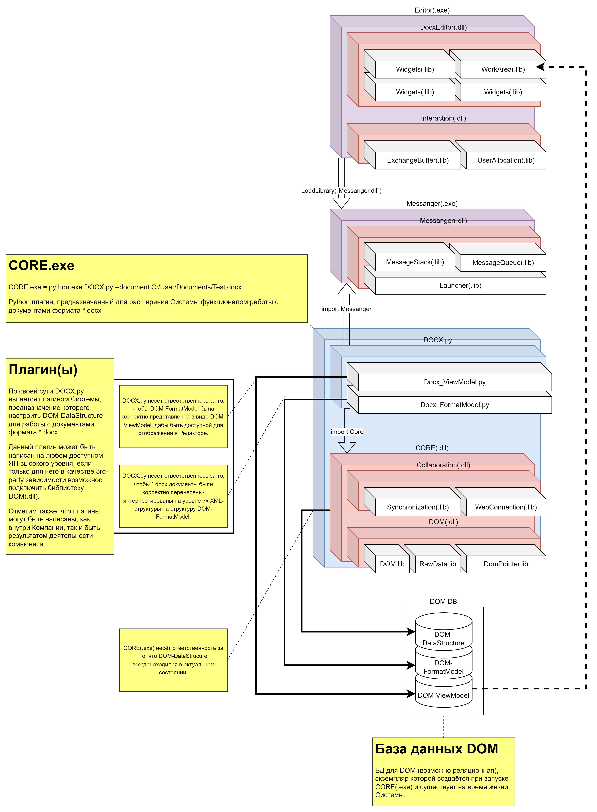

# «5-Level Core Model» описание через артефакты (работа над одним документом)
**Визуализация структуры Системы на уровне её артефактов на различных уровнях и процессах ОС, сорганизованных между собой согласно модели совокупного взаимодействия, ради решения главной задачи - редактирования электронного документа.**

В качестве упрощения, пусть будет введено 2 предположения:
- Целевая ОС - это Windows-10
- Система настроена для работы с единственным документом формата *.docx: C:/User/Documents/Test.docx 




## Приведём последовательное описание процессов происходящих в Системе, при работе над единственным документов формата *.docx:
1. Шаг №1: «Открытие Редактора»
    - Пользователь наживает на иконку приложения MyOfficeEditor
    - Открывается окно Редактора, которое пока не настроено для работы с каким-либо определённым документом, а потому наполнено только самыми общими графическими примитивами:
        - В ОС появляется новый процесс Editor.exe
2. Шаг №2: «Открытие документа»
    - Пользователь нажимает Ctrl+O , вызывая модальное диалоговое окно выбора документа для работы, и выбирает документ C:/User/Documents/Test.docx 
    - Редактор распознает, что документ принадлежит к множеству текстовых документов и предлагает пользователю выбрать один из множества установленных плагинов, предназначенных для работы с данным типом документами:
        - DOCX.py  - плагин написанный на языке Python, каким-то сторонним разработчиком, предоставляющих только возможности для чтения документа (очень маленький и шустрый в виду минимального функционала)
        - DOCX_To_ODT.js  - плагин написанный на Java, каким-то сторонним разработчиком, функционал которого ограничен возможность прочтения и визуального сравнения оригинального документа с аналогичным документом, но переконвертированного в формат ODT
        - MyOfficeDocxPlugin.exe  - плагин Компании, предназначенный для работы с *.docx-документами, отличающийся максимально полными функциональными возможностями для редактирования такого типа документов
    - Т.к. пользователю необходим лишь быстрый просмотр документа, то он выбирает плагин DOCX.py 
    - Запускается, если ещё нет, новый процесс в ОС - Messenger.exe
    - Загружается документ:
        - В операционной системе запускается новый процесс Python.exe DOCX.py --document C:/User/Documents/Text.docx 
            - DOCX.py начинает работу с документом:
                - Происходит парсинг документа в процессе которого формируется структура DOM-FormatStructure, которая автоматически помещается в DOM DB 
                - Поскольку DOM-FormatStructure - это лишь способ интерпретации DOM-DataStructure, то последняя структура создаётся одновременно с DOM-FormatModel, и автоматически помещается в DOM DB 
                - После создания DOM-FormatStructure, происходит создание структуры для отображения в Редакторе, DOM-ViewModel, которая автоматически помещается в DOM DB 
    - Редактор, отследив факт появления в DOM DB структуры DOM-ViewModel, запускает процедуру её отрисовки.
3. Шаг №3: «Работа с документом»
    - Т.к. плагин DOCX.py предоставляет только функционал для просмотра содержимого документа, то:
        таковой плагин передаёт в Messenger.exe минимальное количество команд для создания интерфейса пользователя:
        ```json
        {
            "Widgets" : [
                {
                    "Left Panel" : [
                        "pup-up description" : "Панель фунацинала редактирования документа",
                        "Buttons" : [
                            {
                                "ID" : "AFDC-4587-AD55-03DA",
                                "pup-up description" : "Закрыть документ",
                                "Icon": "C:/ProgrammFiles/MyOffice/Editor/Plugins/Formats/DOCX/DOCX_PY/Buttons/close_button.ini",
                                "Commands" : {
                                    "One Click" : {
                                        "Messanger Queue Name" : "Close Commands Stack",
                                        "Parameters" : None
                                    }
                                }
                            }
                        ]
                    ]
                }
            ]
        }
        ```
4. Шаг №4: «Закрытие документа»
    - Пользователь нажимает кнопку Закрыть документ 
        - Плагин DOM.py  закрывает документ и посылвает команду на закрытие рабочего окна Редактора
        - Редактор закрывает целевое рабочее окно и завршает процесс CORE.exe = Python.exe DOCX.py --document C:/User/Documents/Text.docx