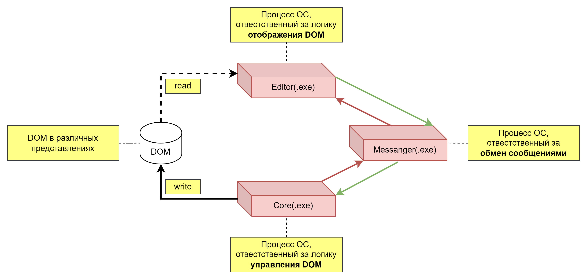

# Описание
- Система в простейшем исполнении (без коллаборации) является суммой трёх процессов ОС, ответственные каждый за своё:
    - «Core(.exe)» - процесс, ответственный за модификацию (и коллаборацию) DOM-данных по средствам управляющих команд, получаемых от «Messanger(.exe)».
    - «Messenger(.exe)» - процесс, ответственный за обмен данными между процессами «Core(.exe)» и «GUI(.exe)».
    - «GUI(.exe)» - процесс, ответственный за визуализацию DOM-данных.