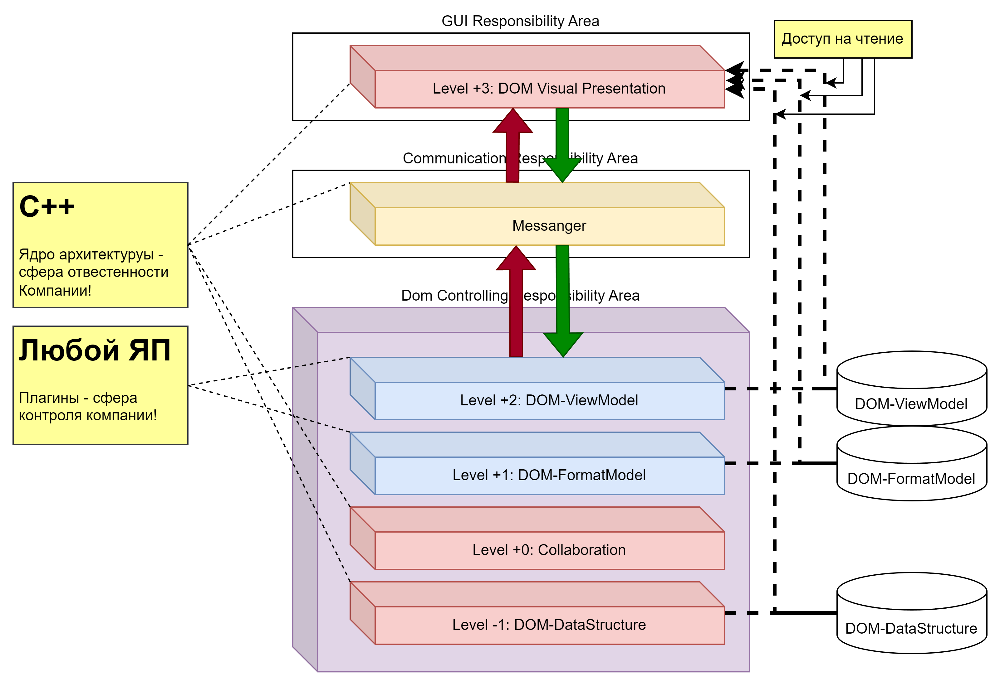

# Общее представление «5-Level Core Model»
**Иерархическая-схема, детально описывающая зоны ответственности и уровни с точки зрения двух положений:**
- Тип данных DOM, с которым работают компоненты Системы на соответствующем уровне.
- Тип ответственности, или специфика задач в масштабах всей Системы, решаемых на соответствующем уровней.

## Описание структуры архитектуры через 5 уровней
- Описание DOM-данных:
    - «DOM-ViewModel» - надстройка над DOM-FormatModel, формирующий на основе DOM-FormatModel структуру данных для отображения.
    - «DOM-FormatModel» - интерпретатор для DOM-DataStructure, представляющий сырые данные в виде данных документа определённого формата.
    - «DOM-DataStructure» - DOM-данные, представленные в виде структуры, элементами которой являются элементарные данные (только числа и строки)
    (здесь реализовано встроенное do/undo/redo на уровне структуры данных).
- Описание областей ответственности («Responsibility Area»):
    - «GUI Responsibility Area» - область Системы, ответственная за отображение DOM-данных.
    - «Communication Responsibility Area» - область Системы, ответственная за передачу управляющих команд (не передаёт DOM-данные).
    - «DOM Controlling Responsibility Area» - область Системы, ответственная за управление DOM-данными.
- Описание уровней Системы («Layers»):
    - Layer +3: «DOM Visual Presentation»
        - Тип DOM данных для работы: работает с DOM-ViewModel.
        - Тип ответственности: отображение DOM-данных.
    - Messenger
        - Тип DOM данных для работы: не работает с DOM-данными.
        - Тип ответственности: передача управляющих команд между двумя соседними уровнями.
    - Layer +2: «DOM-ViewModel» 
        - Тип DOM данных для работы: DOM-ViewModel.
        - Тип ответственности: формирует DOM-ViewModel на основе DOM-FormatModel.
    - Layer +1: «DOM-FormatModel» 
        - Тип DOM данных для работы: Dom-FormatModel.
        - Тип ответственности: формирует DOM-FormatModel на основе DOM-DataStructure.
    - Layer  0: «Collaboration»
        - Тип DOM данных для работы: DOM-DataStructure.
        - Тип ответственности: сихронизация DOM-DataStructure между различными клиентами в процессе совместной работы над документом.
    - Layer -1: «DOM-DataStructure» 
        - Тип DOM данных для работы: DOM-DataStructure.
        - Тип ответственности: осуществляет контроль и обеспечивает целостность DOM-DataStructure.

## О сущностях системы
### ✅ DOM Visual Presentation (DomVP)
**Логическое объединение артефактов Системы, предназначенных для конструирования Редактора.**

Гибкость DOM-DataStructure позволяет использовать её как конфигурируемую/настраиваемую основу под представление абсолютно любых дынных (теста, таблиц, картинок, музыки, и других...), любых форматов (DOCX, XMLX, PDTX, ODT, ODS, ODP, PDF, MD, JSON, и других...).

Отметим что:
- Это единственный уровень, который работает непосредственно с GUI.
- Неограниченность форматов представления данных, доступных для модификации из Редактора, обусловлено двумя свойствами Системы.
- Редактор сам по себе не обладает никакой средой для работы с каким-либо документом, но лишь представляет возможность настроить себя (рабочую область) для работы с документом соответствующего типа.
    - Под настройкой редактора нужно понимать процесс конструирования графической среды работы с документом определённого типа через процесс последовательного наполнения Редактора следующими элементами:
        - общей или специальной, относительно типа документа, рабочей областью (бесконечное поле ввода, ячейки, страницы, слайды, и другие...);
        - gui-виджетами, наполненные элементам управления открытого документа:
        - боковые панели;
        - консоли управления;
        - всплывающие подсказки;
        - всплывающие панели управления по левому клику;
        - и другие элементы, возможно специфические для Редактора.
- Артефакты Системы на данном уровне, главным образом, решают следующие задачи:
    - занимаются созданием основы Редактора:
        - создают главное окно Редактора;
        - определяют графические стили (цветовые темы Редактора);
        - определяют области кастомизации (основная рабочая область, боковые панели, всплывающие панели и другие...).

### ✅ Messenger
**Брокер сообщений уровня ОС - коммуникационная прослойка предназначенная для организации межпроцессорного взаимодействия между двумя соседними областями ответственности системы.**

Messenger работает на уровне операционной системы (ОС), когда бы коммуникация осуществлялась между процессами в одной ОС, что в условиях многопоточности, может обеспечить минимальную латентность реакции двух связываемых уровней Системы на сообщения друг от друга (достаточную для комфортной работы пользователя в Редакторе).

Messenger, будучи локальным брокером сообщений (уровня ОС), хорошо описывается через описание подконтрольных ему очередей сообщений (❗ЛИШЬ ПРИМЕР❗):
- Статические очереди сообщений:
    - DOM New Area Open Request Rising Queue - восходящая очередь, содержащая запросы на выделение в Редакторе новой рабочей области;
    - DOM Existent Area Close Request Bidirectional Queue - восходящая, содержащих запросы на удаление из Редактора существующей рабочей области;
    - DOM Global Exchange Buffer Info Bidirectional Stack - стек сообщений, позволяющий различным рабочим областям обмениваться частями DOM-DataStructure;
- Динамические очереди сообщений, формирующиеся каждый раз при обработке запроса создания новой рабочей области в Редакторе:
    - Work Area Construction Commands Rising Queue - восходящая очередь, содержащая запросы на формирование/конструирование рабочей области Редактора;
    - Selection Changes Info Descending Queue - нисходящая очередь, содержащих информацию об изменении области выделения DOM-FormatModel в связи с действиями пользователя;
    - Selection Changes Request Rising Queue - восходящая очередь, содержащая запросы на изменение выделения в DOM-FormatModel;
    - DOM-Model Changes Request Descending Queue - нисходящая очередь, содержащих запросы на изменение DOM-FormatModel в связи с действиями пользователя;
    - DOM-Model Changes Response Rising Queue - восходящая очередь, содержащих запросы на изменение отображаемой в Редакторе DOM-FormatModel;

### ✅ DOM-ViewModel Layer (DomVML)
**Логическое объединение артефактов Системы, предназначенных создания DOM-ViewModel на основе DOM-FormatModel и некоторых заранее заданных парметров, как например: ширина страницы - для текстовых документов, или высота ячейки - для табличных документов.**

Артефакты Системы на данном уровне, главным образом, решают следующие задачи:
- Определяет специфику визуализации DOM-DataStructure:
    - Создают DOM-ViewModel, в качестве надстройки над DOM-FormatModel;
    - Осуществляют настройку Редактора.

Отметим, что DOM-ViewModel - это структура данных, которая может быть прочитана артефактами Системы на любом другом уровне без каких-либо посредников.

### ✅ DOM-FormatModel Layer (DomFML)
**Логическое объединение артефактов Системы, предназначенных для решения задачи интерпретации DOM-DataStructure в DOM-FormatModel, соответственно формату.**

Важно отметить, что:
- DOM-FormatModel - это лишь интерпретация, т.е. способ прочтения DOM-DataStructure.
- DOM-FormatModel - это структура данных, которая может быть прочитана артефактами Системы на любом другом уровне без каких-либо посредников.

### ✅ Collaboration Layer (CollL)
**Логическое объединение артефактов Системы, предназначенных для решения задачи коллаборации.**

В виду особенностей описываемой Системы, задача коллаборации сильно упрощена, в связи со следующими обстоятельствами:
- Коллаборация необходима только на уровне DOM-DataStrcuture, без необоходимости учёта чего-либо относительно формата документа или способа его визуализации.
- Коллаборация ничего не знает об истории изменений DOM-DataStrucutre, т.к. таковая история изменений в виде механизма do/undo/redo, реализована на уровне самого DOM.

Артефакты Системы на данном уровне, решают две задачи:
- Организует сетевую коммуникацию между DOM-DataStructure разных пользователей работающих над одним документом.
- Решает задачу единствернности/синхронизации DOM-DataStructure в случае наличия конфликтов редактирования.

### ✅ DOM Layer (DomL)
**Логическое объединение артефактов Системы, формирующих/реализующих DOM-DataStructure для Системы.**

Артефакты Системы на данном уровне, решают одну единственную задачу: предоставляют DOM-DataStrucure для Системы.