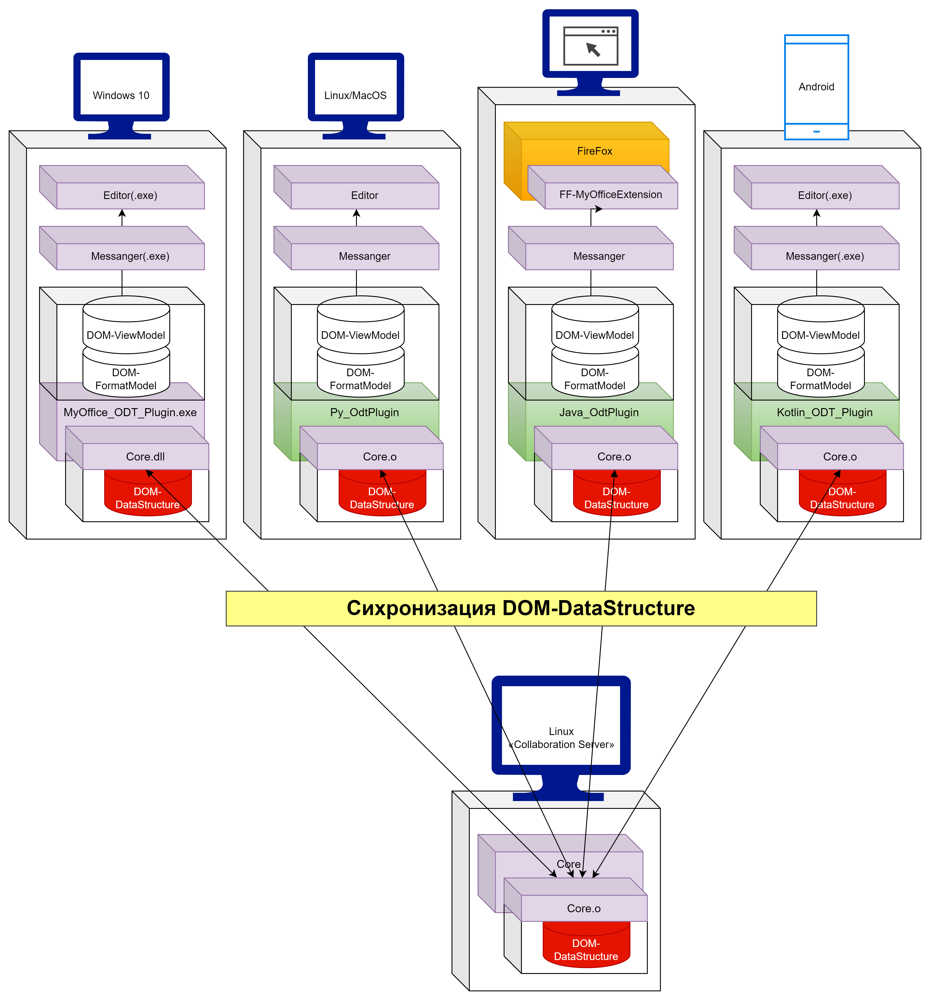

# «5-Level Core Model» режим коллаборации
**Визуализация структуры Системы на уровне её артефактов на различных уровнях в условиях редактирования одного документа множеством клиентов через различные устройства.**

## Ключевые нюансы:
- Коллаборация документа происходит лишь и только на уровне его DOM-DataStructure:
    - Использование библиотеки Core.dll обеспечивает создателям плагинов поддержку коллаборацию, так сказать, из коробки.
- Процесс синхронизации:
    - Клиенты в режиме коллаборации отправляют на Сервер свои изменения в DOM-DataStructure.
    - Сервер проверяет diff на конфликты и если таковые имеются, решает их.
    - Сервер отправляет каждому клиенту его diff от DOM-DataStructure на Сервере, следя таким образом за синхронизацией.