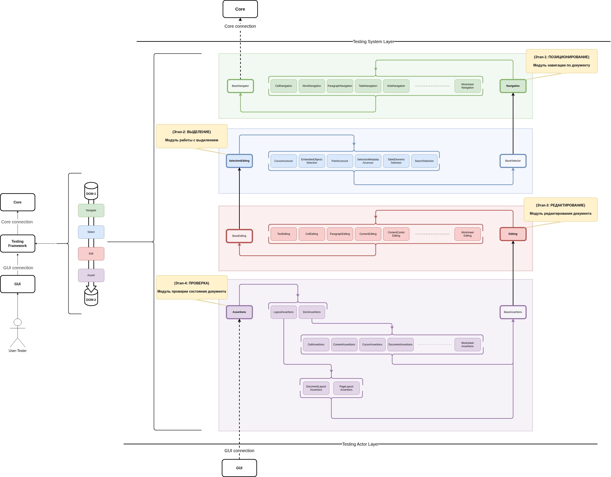

# Testing Framework

Фреймворк автоматического тестирования электронных документов.

## Функциональные требования
Основные:
1. Подключение к тестируемой Системе (Редактору электронных документов) в качестве фреймворка.
2. Может быть API прослойкой между GUI и Core компонентами тестируемой Системы.

Дополнительные:
1. Универсальность на уровне внешних коннекторов (любой ЯП).
2. Универсальность на уровне ОС (Windows-10+, Linux-24+).
3. Возможность развёртки в качестве серверного процесса с подключением через Web.

## НеФункциональные требования
1. Тестировщик, при тестировании документа должен выступать в роли обычного пользователя и от него не должно требоваться специальных знаний в программировании любого рода, а так же специальных знаний о тестируемой Системе.
2. Привносимая задержка в Систему с подключённым тестовым фреймворком не должна превышать 10мс на каждое действие пользователя-тестировщика.

## Основные положения:
- 4 архитектурных уровня-модуля:
    - **1 уровень:** модуль навигации (Navigation)
    - **2 уровень:** модуль выделения (SelectionEditing)
    - **3 уровень:** модуль редактирования (Editing)
    - **4 уровень:** модуль проверки (Assertion)
- каждый модуль:
    - расширяет предыдущий
    - ничего не знает про следующий
    - реализует внутри себя арх-паттерн "композиция"

## Happy Path
Тестирование электронных документов с данным фреймворком, происходит по следующему сценарию:
1. Пользователь-тестировщик, открывает электронных документ, через Систему, подключённую к testing framework;
2. Выполняет тестовые действия (работает) по сценарию:
    - фреймворк транслирует или фиксирует (в зависимости от типа подключения) действия пользователя, создавая тестовый скрипт, а так же фиксирует состояния DOM на каждом из зафиксированных шагов;
3. Сохраняет полученные результаты своей работы:
    - скрипт с последовательностью выполненных действий с документом;
    - БД, содержащую состояния DOM для документа на каждом из выполненных действий при работе с документом.
4. Запускает полученный скрипт (возможно автоматически) и проверяет, что результаты мануального тестирования аналогичны действиям в результате автоматизации.

## Основные преимущества такой архитектуры:
1. Модульность
2. Композиционность
3. Горизонтальная независимость
    - Бесконечное горизонтальное расширение в пределах модуля
    - Изоляция ошибок на уровне метода класса конкретного модуля

## Основные недостатки:
1. 4 строго фиксированных уровня
2. Архитектура диктует правила для паттерна команды (может быть и плюсом, но в масштабах CTF не актуально)